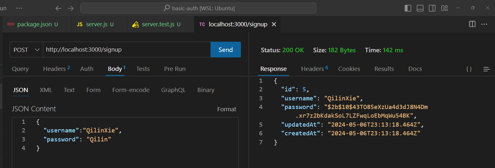
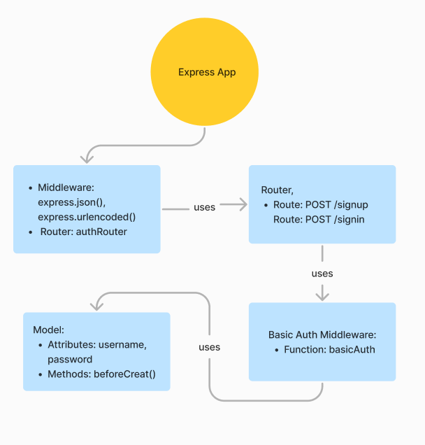

# basic-auth
Authentication System Phase 1: Deploy an Express server that implements Basic Authentication, with signup and signin capabilities, using a Postgres database for storage.

-[class 6 instructor README](https://github.com/codefellows/seattle-javascript-401d58/tree/main/class-06)

-[Github action link](https://github.com/QILINXIE02/basic-auth/actions)

-[PR to main](https://github.com/QILINXIE02/basic-auth/pull/1)

POST: /sign up:

POST: /sign in not working yet

##Auth system UML diagram:
